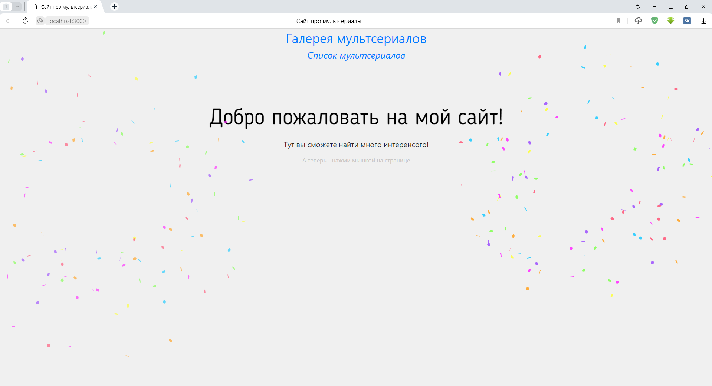
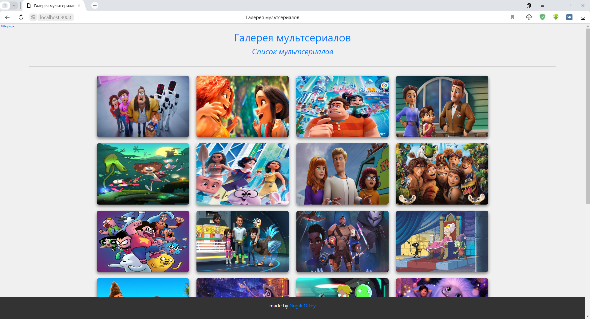
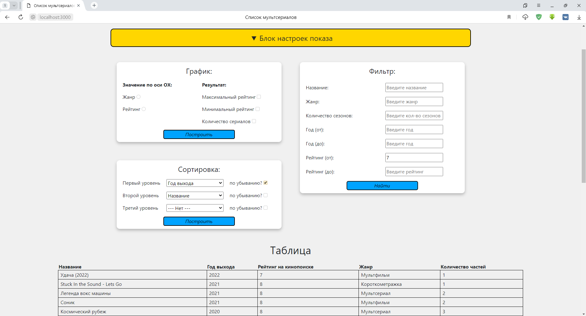
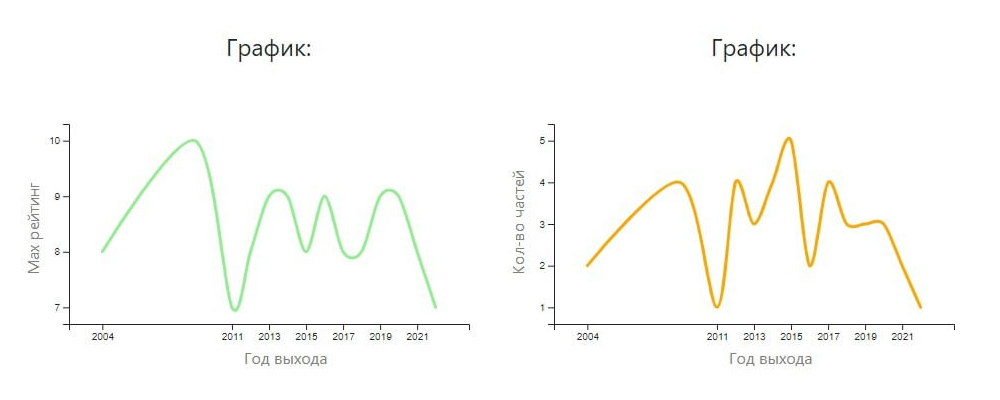

### Мой финальный сайт-проект по предмету Сетевые технологии

Здесь я выбрал тематику - Мультфильмы. По заданию, нужно было создать трёхстраничный сайт, с главной страницей, галереей, и большой таблицей, в которой отображались бы все значения

И к этой таблице нужно было добавить обработчики: Сортировку и поиск по любому полю, а также построение графиков по двум выбранным полям

Код страниц был создан при помощи препроцессоров - Pug и Stylus. Всё это вместе работало на конвейере Gulp, и изменения внесённые в страницу, были видны на ней в реальном времени  
Логика написана на JS

Внутри проекта две папки
* В папке **app** хранятся исходники кода, на Pug и Stylus
* В папке **dist** хранится готовый билд всех страниц сайта

---

Вот так выглядят страницы сайта:

 

Хочу сказать, мне невероятно понравилось создавать этот сайт-проект. Хоть в процессе работы и возникали сложности, но я всё равно испытывал непринуждённое чувство лёгкости, и даже сейчас с большой теплотой вспоминаю время, проведённое за созданием этого сайта ✨💫⭐
